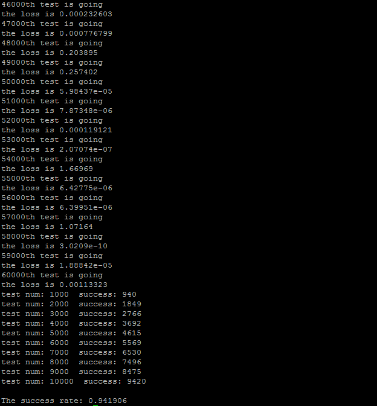

# easy_neural_network
a single c++ file for learing how data flow graphs work.

## 1. Introduction
This repository shows you how some deep learning frameworks work. The core parts of `main.cpp` are `class Unit` and `class Gate`. `Unit` is the node in computation graph if you know reverse-mode automatic differentiation. `Gate` is the math operation in computation graph. I derive many other gates from `class Gate`, such as `AddGate` to do add operation, `SigGate` to do a sigmod function operation. In the test part, I use mnist database to test if my program works well.

## 2. How to run this program
I recommend you to compile this program use `g++`. If you want to run this program, follow these steps:
```bash
git clone https://github.com/ucker/easy_neural_network.git
cd easy_neural_network
cd src
g++ main.cpp -o main -std=c++11
./main
```
After a few minutes, my result of the program looks like that:


## 3. Development plan
1. Add more annotations.
2. I will add some gates like `ConvGate` and `MaxpoolGate` soon, so that I can make a convolutional neural network.
